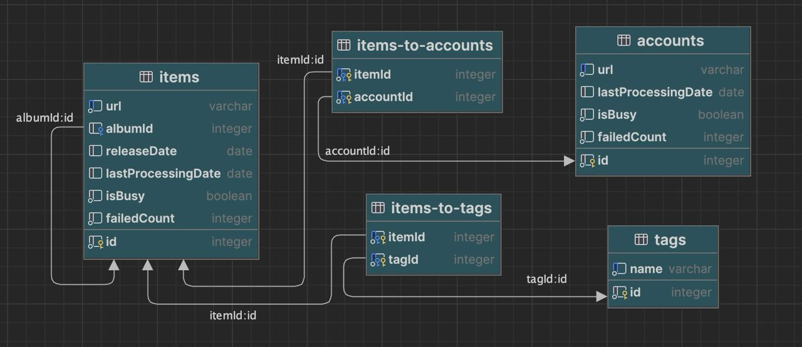

<br/>
<div style="width: 100%; display: flex; flex-direction: column; align-items: center; background: linear-gradient(to right, #2b809d, #1d5669, #2b809d); padding: 20px; border-radius: 15px; margin: 10px 0;">
    
    <h1 style="margin-top: 10px; margin-bottom: -8px; color: rgb(17 24 39); font-family: 'Helvetica Neue', Helvetica, Arial, sans-serif;">Band Spider</h1>
</div>

**band-spider** is a web scraper for [bandcamp](bandcamp.com). It stores information about albums, tracks, their tags, labels, and accounts that purchased them.

## 🛠️ Installation

Clone the repository and install dependencies:
```shell
  git clone https://github.com/borbiuk/band-spider.git \
  && cd band-spider \
  && npm i
```

## 🚀 Run

### 📁 Run the app using the **file** as the initial data source

**NOTE:** *DB will be created automatically*

Fill the file `accounts.txt` with links to accounts of bandcamp and run:
```shell
node run file:accounts
```

**Or** fill the file `items.txt` with links to albums/tracks of bandcamp and run:
```shell
node run file:items
```

### 💾 Run the app using the DB as the data source

To start process saved accounts:
```shell
node run db:accounts
```

To start process saved albums/tracks:
```shell
node run db:items
```

## 🕵️ Debug Mode

By default browser will be running in `headless` mode, to run a browser with GUI use the `debug:` prefix in the command:
- `node run debug:file:accounts`
- `node run debug:file:items`
- `node run debug:db:accounts`
- `node run debug:db:items`

## 📀 How&What data we store



## 🐤 What data should be added to parsing

1. Item image (The new `image` column in `items` table)
2. Wishlist relation (The new `isWishlist` column in `item-to-tag` table)
3. Account item index (The new `index` column in `item-to-account` table)
4. Labels (New `labels` and `item-to-label` tables)
